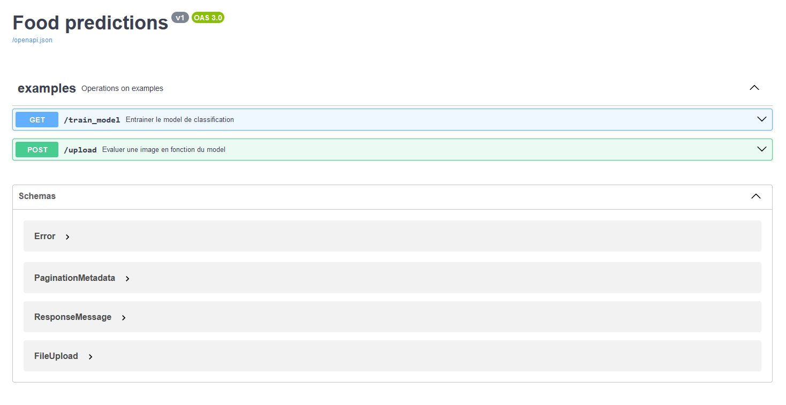

# HealthFood 

This project is a train to classification of Food images. Now there is classification between apples and bananas. 

# 👩‍💻 Technologies

| Back - Python Flask | version (works) | 
| --- | --- |
| Python | 3.12.8 |
| Pip - Flask | 3.0.3 |
| Pip - Flask-smorest | 0.44.0|
| Pip - Marshmallow | 3.21.3 |
| Pip - Torch | 2.3.1+cu118 |
| Pip - Torchvision | 0.18.1+cu118 |
| Pip - Numpy | 1.26.3 |
| Pip - Matplotlib | 3.9.0 |

# 🛠 Project and funtionnalities

...

# ⚡️ Execution

To execute the API server :

```bash
python .\main.py
```

URL of swagger : http://localhost:5000/swagger-ui

# Visualisation

